<h1 align="center"> EXPLORATORY DATA ANALYSIS </h1>
<h2 align="center"> Towards the Three Subjects On Overall Score
  In PISA 2012 Dataset </h2>

Kushal Borkar Sept-2019

## Dataset

PISA is a unique global survey that examines how well prepared 15 year old students are for life after they have completed school. PISA's goal is to assess students' preparation for the challenges of life as young adults. PISA assesses the application of knowledge in mathematics, science, and reading literacy to problems within a reallife context (OECD 1999).

The data can be found [here](https://s3.amazonaws.com/udacity-hosted-downloads/ud507/pisa2012.csv.zip&sa=D&ust=1554482573645000), with feature documentation available [here](https://s3.amazonaws.com/udacity-hosted-downloads/ud507/pisadict2012.csv&sa=D&ust=1554482573645000).

## Summary of Findings

### For my analysis, I wanted to focus on few of the below mentioned things:

#### Distribution of Maths, Reading and Science scores, independently

- **_We are keen on discovering how students from individual nations perform in Maths, Reading and Science proficiency._**
- _For that, we will check the normal world and nation wide distribution of Maths, Reading and Science education scores, independently._

___Results___

  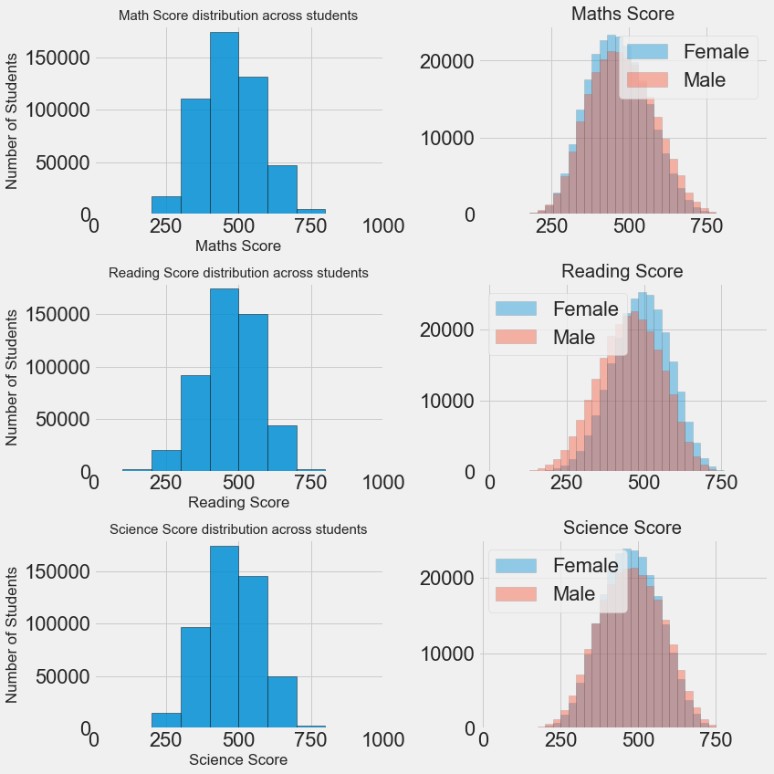

 

___Inference from the above graph___

- The proficiency scores are spread out in a reasonable, clear, smooth uni-modal distribution of values
- Most of the students are scoring in each subject somewhere in the range of 300 and 600 points, while a little part of the all out number accomplishes poor score (somewhere in the range of 100 and 300) or more noteworthy (somewhere in the range of 600 and 800) test results
- For each one of these three score appropriations, most students fitted inside the interim of scores somewhere in the range of 400 and 500 points, which happens to likewise be the centre interim of the conceivable score run. This demonstrates the PISA 2012 test has been developed in a proper way.

--------------------------------------------------------------------------------

#### Top percentile of students and Gender distribution

- **_Furthermore, we wanted to take a look at just the top percentile of students and see how gender is distributed._**

  - _For that, we will break down the gender of the student with respect to the subjects Math, Reading and Science Score._

___Results___

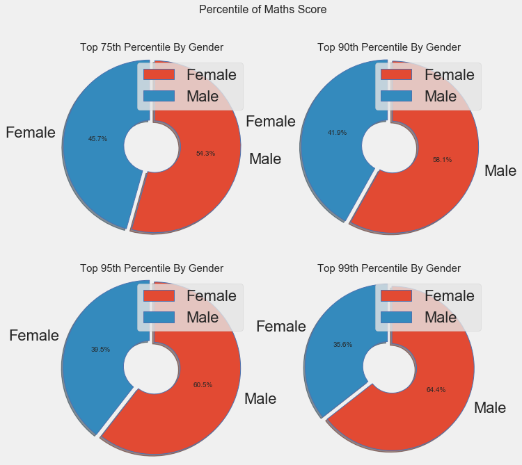

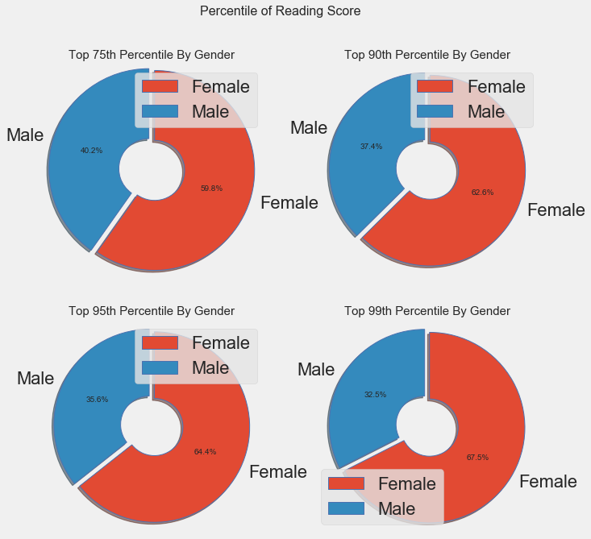

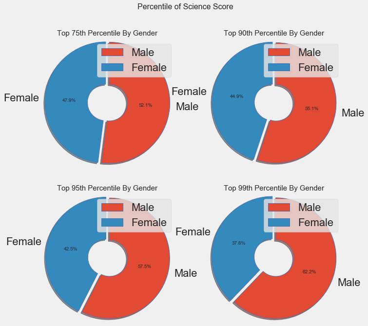

___Inference from the above graph___

- The proficiency scores are spread out in a reasonable, clear, smooth unimodal distribution of values Distribution of Math, Reading and Science scores, independently
- Most of the students are scoring in each subject somewhere in the range of 300 and 600 points, while a little part of the all out number accomplishes poor score (somewhere in the range of 100 and 300) or more noteworthy (somewhere in the range of 600 and 800) test results

--------------------------------------------------------------------------------

#### Distribution of Students Country-Wise

- **_Thirdly, we need to know which gender of students perform better a role in Math, Reading and Science education based on the country they come from_**

  - _For that, we will investigate the gender of the student from the country they belong with respect to the subjects Math, Reading and Science Score._

___Results___

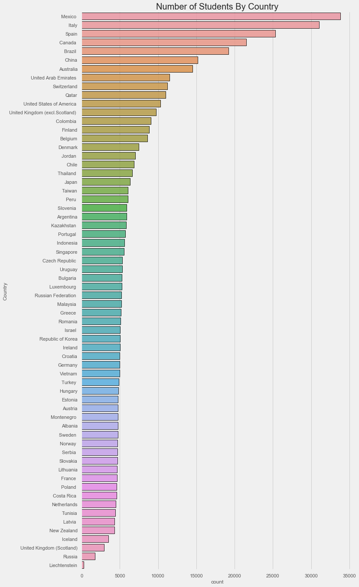

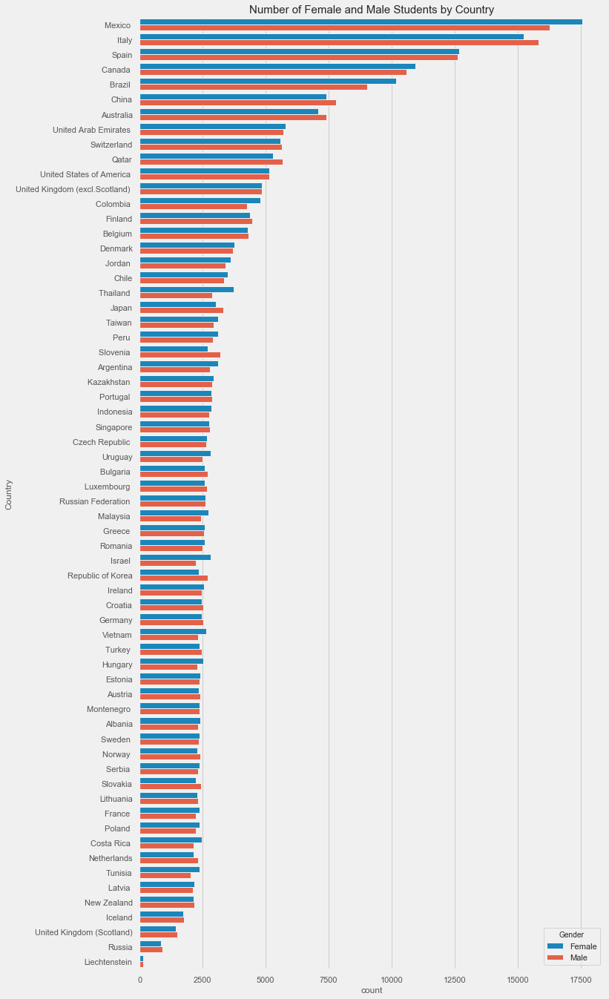

___Inference from the above graph___

- _Most countries have between 5000 to 10000 students taking the survey. The countplot also shows that there are a few countries which are not bounded these limits._
    - For example, Mexico and Italy have over 30,000 students and Liechtenstein has well below 1000 students.
- _While most countries show an almost 50/50 split between gender, there are some countries like Mexico, Thailand and Israel that show an very uneven split._
  - So, to check the uneven split between gender, we tried to know the gender split in different countries.
  - Almost half of the countries have a difference in gender of about 2% and lower for students. It even looks like 2 countries have a difference of more than 10%.
  - If we take a look at the top 10 countries with the most gender differences, 8 out of 10 countries are female dominated.

---

#### Subject-Wise Distributions By Country

After finding out previously the gender percentile distribution for each literacy category, we are interested to look into the relationship how the country of residence/education affects scores on each of the subjects individually.

- ___We need to know which gender perform better a role in student's performance country shrewd in Math, Reading and Science education.___
    * _For that, we will investigate the gender of the student dependent on the country they belong with respect to the subjects Math, Reading and Science Score._

___Results___

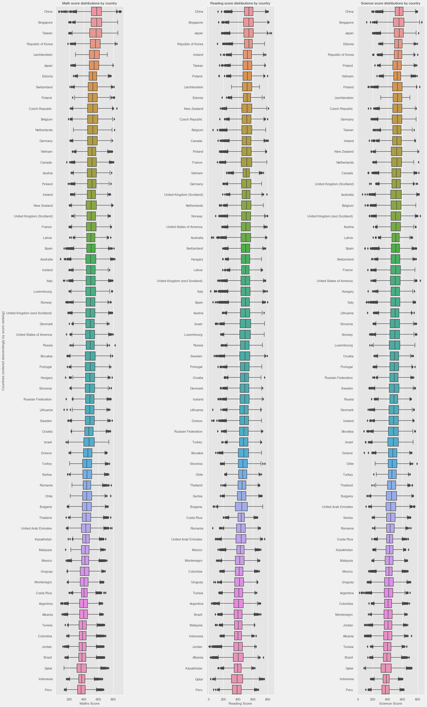

___Inference from the above graph___

- _For every one of these three score distributions, most understudies fitted inside the interval of scores somewhere in the range of 400 and 500 points, which happens to likewise be the middle interval of the conceivable score range._

- _From the top positioning of nations, we can obviously observe that it was no coincidence that exceptional students come from Asian countries, specifically China and Singapore, as these are the nations which are first, second or third place over all subjects. Another nation which intrigued was Poland, with 3 remarkable students in Mathematics._

___

#### Gender Differences in Subjects By Country

We will see the differences in Pisa scores by gender and subject (math, reading, and science) across countries.

- **_We would like to know which gender is performing better in Math, Reading and Science education._**

  - _For that, we will investigate the percentage difference among the genders of the student based upon the country they belong with respect to the subjects Math, Reading and Science Score._

___Results___

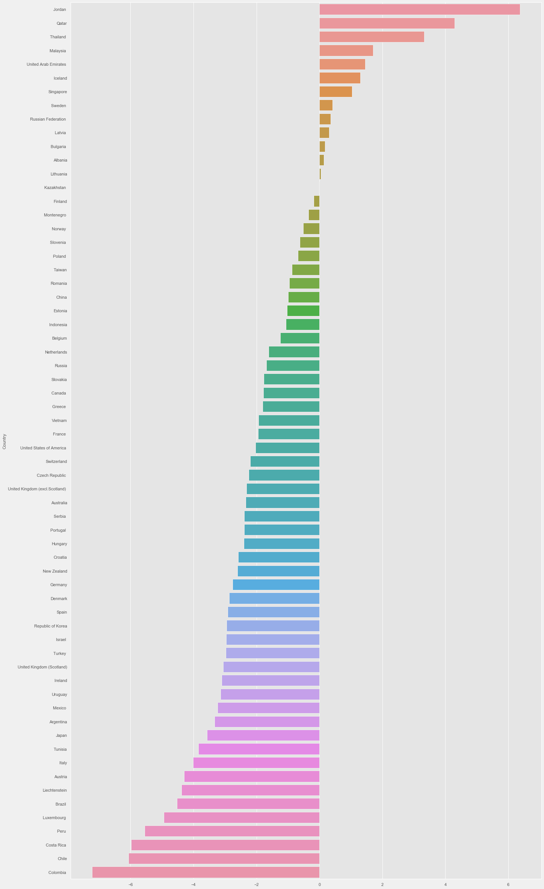

___Inference from the above graph___

- These plots represent the % difference in scores using males as reference. A positive difference means females scored higher, while a negative difference means females scored lower. The blue line represents the mean difference across all countries.
- It looks like females are just better at reading! Females had higher reading across all countries.
- It seems as if science shows similar trends to maths.

---

#### Family background distribution

- **_We likewise need to analyze whether parents from the same cultural background(those from a same country) has any influence in student's presentation country wise in Math, Reading and Science proficiency._**

  - _For that, we will analyze the parents from Same Cultural Background dependent upon the country they belong to with respect to the subjects Math, Reading and Science Score._

___Results___

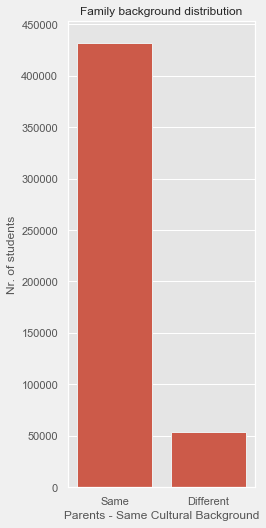

___Inference from the above graph___

_While almost all the countries shows very high number of parents coming from same cultural background._

- There are some countries like 'Poland', 'Indonesia', 'Vietnam' and 'Turkey' which has almost all the parents have same cultural background(which is more than 95%).

- Almost half of the countries have parents with same cultural background of about 70%. It even looks like only one country have a different cultural background of less than 10%. We have this example as 'Liechtenstein'.

---

#### Parents from Same Cultural (Country) Backgrounds Vs Different Cultural (Country) Backgrounds

After finding out previously the gender percentile distribution for each literacy category, we are interested to look into the relationship how the country of residence/education affects scores on each of the subjects individually.

___Results___

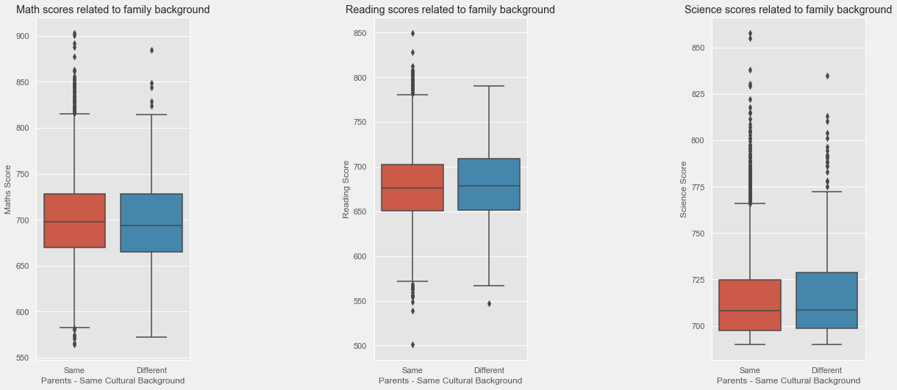

___Inference from the above graph___

- _It tends to be seen that, on average, students originating from heterogenic family foundations report expanded performance in all areas, contrasted with understudies from homogenous family foundations._

---

#### Parent’s Occupation

One of the variables the dataset addressed was the occupation of each of the parents. There were five possible categories: “Full-Time”, “Part-Time”, “Not working, but looking for a job”, “Other (e.g. home duties, retired)”, and no response.

- **_So, we would like to see the how the individual parent occupation effects student's performance._**

___Results___

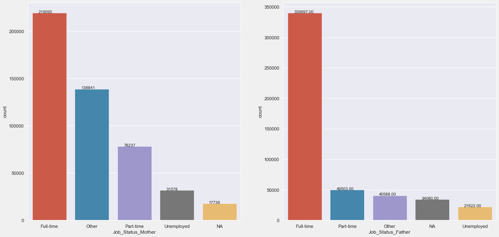

___Inference from the above graph___

From the above distributions, we find out that:

  -  The distribution of the number of parents who selected each of the categories can be seen in the bar chart.
  -  The chart shows that father’s primarily have full-time jobs.
  -  However, there are large numbers of mothers who work full-time, part-time, or are stay-at-home moms, with women making up a larger portion of the work-force.

---

#### Pair-By-Pair Relationship Between Different Subjects

We wanted like to know whether it is normal that most countries who had many students scoring high in one of the subjects, also had, on average, students scoring high on the other two subjects.

Henceforth, we are going to study the pair-by-pair relationship between Math Scores, Reading Scores and Science Scores, and correlate them in pair scatter plots and the kdeplot, in order to see what type and strength of correlation exists.

 ___Results___

 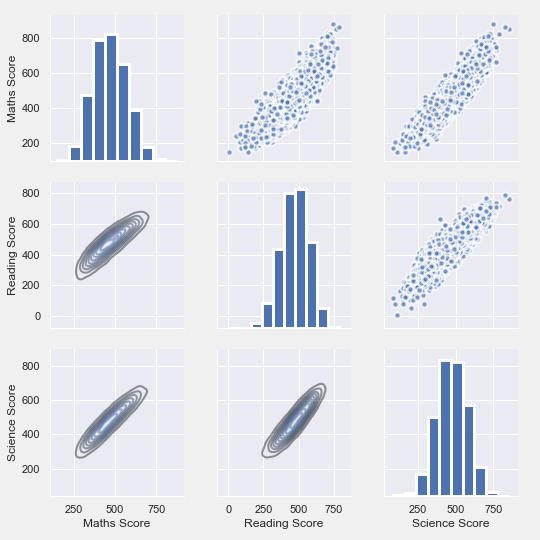

 ___Inference from the above graph___

 From the above distributions, we find out that:
- There is a solid and positive correlation between any pair of the three factors representing to the scores of the three subjects.
- Therefore, the previous relationships between scores observed in the behaviour of many countries' students is justified.
